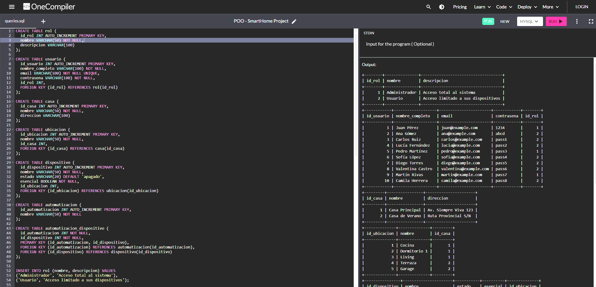

# 📘 Cómo ejecutar los scripts SQL de nuestro proyecto en OneCompiler (MySQL)  

Este proyecto incluye **scripts SQL** para crear la estructura de la base de datos `POO-SmartHome`, cargar datos de prueba y ejecutar consultas de verificación.  
Se recomienda usar **[OneCompiler](https://onecompiler.com/mysql)** para correr los scripts de manera sencilla, sin necesidad de instalar nada.  

---

## 📂 Archivos del proyecto  
- `Estructura.sql` → Crea las tablas, claves primarias y relaciones.  
- `Datos.sql` → Inserta registros de ejemplo en cada tabla y ejecuta consultas de verificación.  

---

## 🚀 Pasos para ejecutar en OneCompiler  

1. Ingresá a 👉 [OneCompiler - MySQL](https://onecompiler.com/mysql).  

2. Copiá y pegá el contenido de **`Estructura.sql`** en el editor de OneCompiler.  
   - ⚠️ **Importante:** OneCompiler no permite crear bases nuevas ni usar `USE`.  
     - Eliminá o comentá las líneas:  
       ```sql
       DROP DATABASE IF EXISTS `POO-SmartHome`;
       CREATE DATABASE `POO-SmartHome`;
       USE `POO-SmartHome`;
       ```  
     - Trabajá directamente con la base que OneCompiler te da por defecto.  

3. Ejecutá el script haciendo clic en **Run**.  

4. Luego copiá y pegá el contenido de **`Datos.sql`**.  
   - ⚠️ También eliminá o comentá la línea:  
     ```sql
     USE `POO-SmartHome`;
     ```  
   - Este script inserta roles, usuarios, casas, ubicaciones, dispositivos y automatizaciones.  
   - Al final, agregá consultas `SELECT` para verificar que los datos se cargaron correctamente.  

5. Ejecutá nuevamente con **Run** y verificá los resultados en la consola.  

---

## 🗄️ Tablas principales  
- **rol** → Define los roles de los usuarios (Administrador / Usuario).  
- **usuario** → Información de los usuarios y su rol.  
- **casa** → Viviendas registradas.  
- **ubicacion** → Espacios específicos dentro de cada casa.  
- **dispositivo** → Dispositivos inteligentes en las ubicaciones.  
- **automatizacion** → Modos o configuraciones automáticas.  
- **automatizacion_dispositivo** → Relación N:N entre automatizaciones y dispositivos.  

---

## 🖼️ Resultado esperado en OneCompiler

Si ejecutaste correctamente los scripts (`Estructura.sql` y `Datos.sql`) en OneCompiler, deberías ver algo similar a esto en la consola:



> Cada tabla muestra los registros cargados, confirmando que los datos se insertaron correctamente.


👨‍💻 Autor: *GRUPO M*
